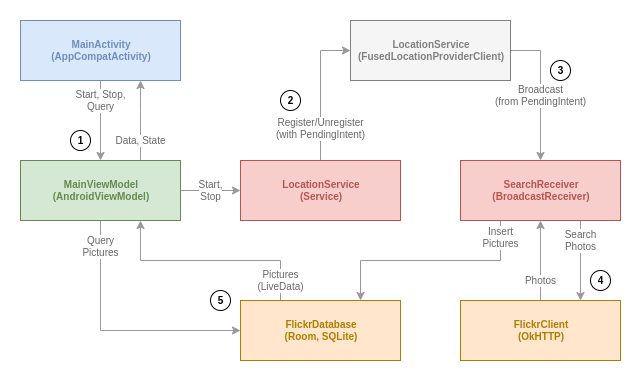

# Trackr

This is an example app that showcases how one could use the Android location services and tie it to cloud services to enable a useful app. This particular implementation allows the user to start tracking his/her hike meanwhile showing public photos from Flickr that were taken in the immediate area.

## Source code
The source code is provided as a Gradle project. You should be able to import it "as is" to your favorite IDE (tested with a fairly recent version of IntelliJ Community Edition).

You can also build a (debug) API and install it directly from the terminal:

```sh
# If you haven't exposed your Android SDK location globally,
# you may need to specify it in a local properties file.
echo "sdk.dir=/path/to/Android/SDK" > local.properties

# Now, build and install
./gradlew clean installDebug
```

The project depends on Android API 29 ("Android 10") and is backwards compatible all the way down to Android API 21 ("Android 5.0 Lollipop").

## Unit tests

You can run the tests by issuing below command. The test results will be summarized in the terminal and the full report is available in the `app/build/reports/tests/` directory.

```sh
# Again; ensure your Android SDK path is defined, then
# you can run all unit tests for all configurations
./gradlew clean test
```

## Design documents
The coarse grained architectural design of the application looks something like this:



The design if fairly simple and pivots around the MVVM reactive design pattern. There is a single `Activity` in there, a `Service` (started as a foreground service - detaching the location update lifecycle from the focus dependent activity) and a `BroadcastReceiver` to handle the actual location updates. All three application components provides isolated and separated context's to the three main concerns: **user interaction**, **event listening** (location updates) and **data aggregation**.

On top of that there is a dependency to the Android system's location service (`FusedLocationProviderClient`) which will provide the actual geo-location updates, but this is in the system context and out of our control.

In the bottom there is a `Room` ORM layer wrapping a standard SQLite database, and a custom Flickr service client (built on top of `OkHTTP`) isolating the data retrieval concern.

### Data flow

A very brief description of the data/event flow of the single use-case implemented would look something like this (the numbered list below corresponds to the numbers in the chart above):

1. The user starts a tracking session which will start a foreground-service.
2. The foreground-service configures which type of location updates it wants from the Android Locations system service.
3. The system service broadcasts a pre-configured `Intent` every time there is a matching location update.
4. The broadcast is caught by a `BroadcastReceiver` which will issue a request to the Flickr cloud service, searching for public photos at a given location (allowing a slight radial discrepancy). Any returned data is written to the local database for later use.
5. The write operation to the database updates the list of pictures (reactive operation with LiveData) in the `Activity` which now will download (and temporarily cache) the actual photos and show them in a list.

## Known concerns

There are some known shortcomings with the current implementation:

1. The state replication between the `LocationService` and the `MainActivity` isn't too solid. There is at least one use-case where the activity won't know what state the service is in.
2. The internal state keeping in the `LocationService` isn't robust at all. Would it receive a second start `Intent` it would try to register with the system location service again. I suspect the combination of these two are the root cause for some crashes I see every now and then.
3. A bit more time is needed to experiment with the location update frequency configuration. Especially, it would be interesting to measure the battery consumption over a longer time of period and with a wider spectra of devices and Android versions.
